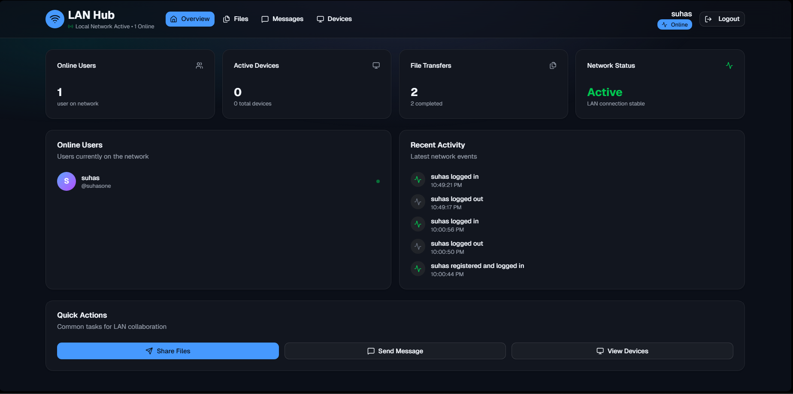
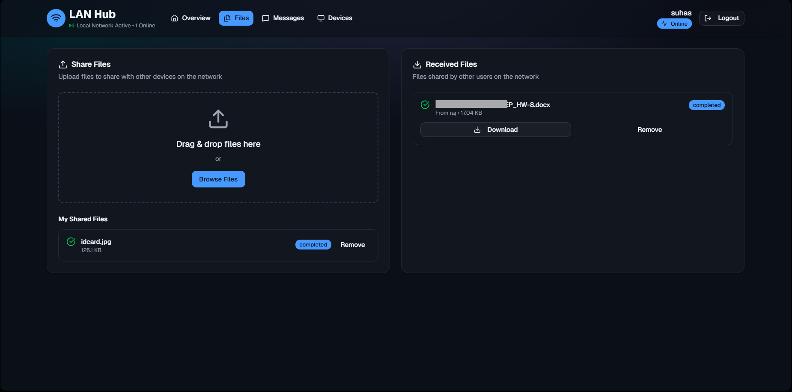
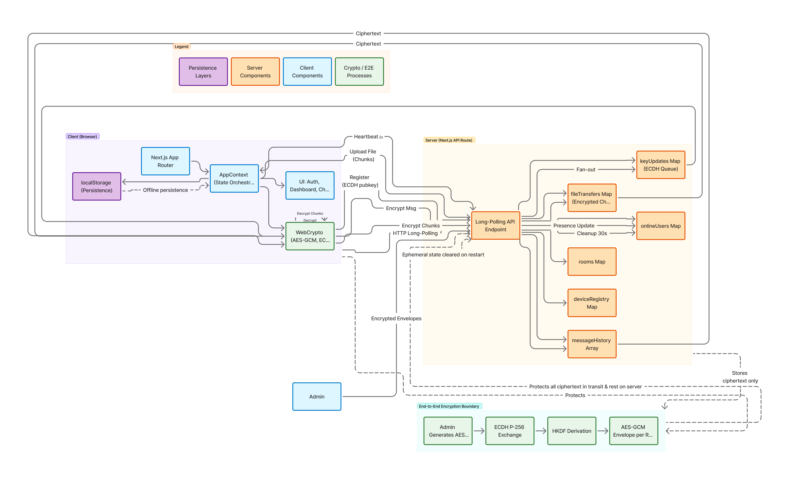

LAN Hub – Secure Local Collaboration
===================================

A LAN-first collaboration app that lets users on the same network chat, create rooms, and share files with optional end‑to‑end encryption (E2EE) – all without a server database.

## Screenshots

### Overview Dashboard
<p align="center">
  
  <br />
  <em>Main dashboard showing online users, devices, and system overview</em>
  <br />
</p>

### File Sharing Interface
<p align="center">
  
  <br />
  <em>File transfer interface with progress tracking and download management</em>
  <br />
</p>

### Architecture
<p align="center">
  
  <br />
  <em>High-level system architecture: client-side E2EE, in-memory server state, polling transport</em>
  <br />
</p>

Key points
- Client state is persisted in the browser via `localStorage`.
- Server keeps only in‑memory snapshots (presence, rooms, messages, file chunks). A process restart clears server state.
- E2EE for chat and files uses AES‑GCM 256 with keys derived/exchanged client‑side via WebCrypto (ECDH P‑256 + HKDF). The server never sees plaintext.

> [!NOTE]
> The server is not a confidentiality boundary. All sensitive content is encrypted end‑to‑end in the browser before transport and storage on the server.

Features
- User auth (lightweight, local-only) and presence tracking on the LAN
- Public/private chat rooms with basic admin actions (kick, set admins, transfer ownership, delete)
- Messaging with optional E2EE per room (ciphertext stored server‑side)
- File sharing with chunked uploads/downloads; each chunk optionally E2E‑encrypted
- Device discovery simulation and online device registry
- Heartbeat-based sync loop for presence, messages since last sequence, room updates, key updates, and file availability

How E2E works (chat + files)
- Room key: AES‑GCM 256 generated by an admin or derived from a passphrase. Stored locally as JWK.
- Key exchange: Each user has an ECDH P‑256 keypair stored locally. Admin encrypts the room key per recipient using ephemeral ECDH → HKDF(SHA‑256) → AES‑GCM and sends an envelope via the server. Recipients decrypt client‑side and store the room key.
- Messages: Encrypted on the sender with the room key. Server stores `{ ctB64, nonceB64, enc: true }`. Receivers decrypt on sync.
- Files: Each chunk is encrypted on the sender with the room key; server stores only ciphertext + nonce per chunk. Receivers download, decrypt, and assemble blobs locally.
- Fallbacks: If WebCrypto secure context is unavailable, a local passphrase (`lanhub_room_passphrase`) can derive the room key; `lanhub_allow_insecure=true` allows plaintext for testing.

> [!TIP]
> For local HTTP development without TLS, set a shared passphrase in `localStorage` to derive the room key: `lanhub_room_passphrase`.

Architecture overview
- Client (Next.js App Router)
  - UI components render chat, rooms, and files.
  - `src/contexts/AppContext.tsx` is the orchestrator: manages state, crypto, and polling to the server.
  - Persists domain data and keys to `localStorage` with `src/lib/local-storage.ts`.
  - Performs crypto via `src/lib/crypto.ts` using WebCrypto (AES‑GCM, ECDH, HKDF).
- Server (Next route handler)
  - `src/app/api/ws/route.ts` exposes a polling POST API: `register_user`, `heartbeat`, `send_message`, `create_room`, `update_room`, `delete_room`, `key_update`, and file transfer endpoints.
  - Stores presence, rooms, messages, file transfer metadata/chunks, and key update queues in memory only.
  - Returns deltas since `lastSeq` for messages and queued key updates to clients on heartbeat.

High-level data flow
1. Login/Register: client stores user locally and registers with server (includes user ECDH public key).
2. Key distribution: admin creates/derives room key → packs per‑user envelopes → server queues → recipients unpack and persist key.
3. Messaging: client encrypts with room key → server stores ciphertext → clients fetch on heartbeat and decrypt.
4. Files: sender encrypts chunks → uploads → receivers list/download chunks → decrypt and assemble → optional chat message with file metadata.
5. Presence/Devices: periodic heartbeats refresh presence; server prunes stale entries.

Project structure
```
src/
  app/
    api/ws/route.ts            # polling API route; in‑memory presence/rooms/messages/files/key-updates
    layout.tsx                 # root layout, theme, global scripts
    page.tsx                   # entry; renders auth or dashboard
  components/                  # UI components (AuthForm, Dashboard, Messaging, etc.)
  contexts/
    AppContext.tsx             # app state, crypto orchestration, server sync, file transfers
  lib/
    crypto.ts                  # WebCrypto helpers: AES‑GCM, ECDH, HKDF, pack/unpack room keys
    local-storage.ts           # Local persistence for users/devices/messages/files/rooms/activity
  types/
    index.ts                   # Domain models: User, Device, Message, FileTransfer, ChatRoom, ActivityLog
  visual-edits/                # Visual edit tooling (if used)
public/                        # Static assets
```

Getting started
```bash
npm install
npm run dev
# LAN dev (port 8080)
npm run dev:lan
```

Open `http://localhost:3000` (or LAN address printed in the console if using `dev:lan`).

Notes & limitations
- No server database; server state is ephemeral. Restarting the server clears presence, rooms, messages, and file buffers. Clients preserve their own history via `localStorage`.
- E2EE requires WebCrypto in a secure context (HTTPS). For local testing without HTTPS, use the passphrase fallback or temporarily enable plaintext as described above.
- The “WebSocket” route is a long‑polling API due to serverless constraints; real WebSocket would require a custom server.

Security model (short)
- Confidentiality: provided end‑to‑end by client‑side AES‑GCM with per‑message/per‑chunk nonces. The server stores ciphertext and cannot decrypt.
- Integrity: provided by AES‑GCM AEAD. Transport integrity relies on HTTPS in production.
- Access control: enforced primarily via possession of the room key. Server-side recipient filters are best‑effort and not a trust anchor.

Tech stack
- Next.js 15 (App Router), React 19, TypeScript
- WebCrypto (AES‑GCM, ECDH P‑256, HKDF)
- Tailwind UI ecosystem (Radix UI, shadcn/ui components, etc.)

License
MIT
